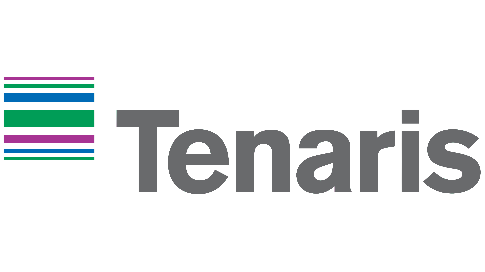

<div align="center">
  <p align="center">
    
    &nbsp;&nbsp;&nbsp;&nbsp;&nbsp;&nbsp;&nbsp;&nbsp;&nbsp;&nbsp;&nbsp;&nbsp;&nbsp;&nbsp;&nbsp;&nbsp;
    
  </p>

  # MandrelAI

  **Sistema de Visión Computacional para el Monitoreo de Mandriles y Control de Calidad en Tiempo Real**  
  *Solución de Inteligencia Artificial para la laminación de tubos de acero sin costura en Tenaris*

</div>

MandrelAI es una solución de visión computacional desarrollada para Tenaris que automatiza la inspección de mandriles durante la laminación en caliente de tubos de acero sin costura. Detecta defectos como material adherido, desgaste y deformaciones antes de que se transfieran al interior de los tubos, ayudando a reducir el scrap y a reemplazar el control de calidad reactivo por una detección temprana.

<p align="center">
  <video src="docs/videos/webpage-gif.mp4" autoplay muted loop playsinline width="100%"></video>
</p>

---

## 📌 Decisiones de Diseño y Arquitectura

Para conocer las justificaciones técnicas, la selección del modelo y las estrategias utilizadas, consulta:

👉 **[Decisiones de Diseño y Arquitectura de IA](docs/decisiones_tecnicas.md)**

---

## 📋 Requisitos Previos

* **Python:** 3.9 o superior (probado en Python 3.10 - 3.13)
* **Gestor de paquetes:** `pip`

---

## 🚀 Instalación Rápida

1. **Clonar o acceder al repositorio:**
   ```bash
   cd tenaris-ia
   ```

2. **Crear y activar un entorno virtual (recomendado):**
   * En macOS / Linux:
     ```bash
     python3 -m venv venv
     source venv/bin/activate
     ```
   * En Windows:
     ```cmd
     python -m venv venv
     venv\Scripts\activate
     ```

3. **Instalar las dependencias:**
   ```bash
   pip install -r requirements.txt
   ```

---

## 💻 Cómo Correr el Proyecto

El proyecto ofrece varias modalidades de ejecución según el caso de uso:


### 1. Aplicación Web Interactiva (Recomendado para Demostración)
Inicia el panel de control de planta para visualizar la inspección en tiempo real, comparar la imagen infrarroja original con la inferencia de la red y observar la activación del semáforo de planta:

```bash
streamlit run webapp/app.py
```

> Una vez ejecutado, se abrirá automáticamente en tu navegador en `http://localhost:8501`. Permite seleccionar imágenes de prueba de la galería lateral o subir imágenes personalizadas.

---

### 2. Inferencia en Lote y Pruebas Rápidas
Para ejecutar predicciones sobre imágenes de prueba y guardar los resultados procesados con sus etiquetas y recuadros en la carpeta `test_results/`:

```bash
python src/predict.py
```

---

### 3. Auditoría y Métricas del Modelo sobre el Set de Test
Calcula la matriz de confusión, aciertos, falsas alarmas y métricas de desempeño industrial sobre las imágenes reservadas de test:

```bash
python src/evaluar_test.py
```

Para una evaluación exhaustiva sobre todo el dataset:
```bash
python src/evaluar_dataset_completo.py
```

---

### 4. Simulación de Video en Tiempo Real
Simula la alimentación continua de fotogramas desde la cámara de planta y la velocidad de respuesta de la IA:

```bash
python src/demo_video.py
```

---

### 5. Reentrenamiento del Modelo (Pipeline Completo de Datos)
El repositorio ya incluye los pesos entrenados listos para producción en `runs/detect/mandrel_detector_v1/weights/best.pt`. Si deseas reentrenar desde cero:

1. **Preparar y estructurar el dataset:**
   Convierte las anotaciones JSON a formato YOLO realizando un split balanceado 80/10/10 que preserva clases críticas:
   ```bash
   python src/prepare_dataset.py
   ```

2. **Iniciar el entrenamiento de YOLOv8 Nano:**
   ```bash
   python src/train.py
   ```

---

## 🚦 Lógica del Semáforo Operativo

| Estado | Significado Industrial | Acción del Sistema |
| :---: | :--- | :--- |
| 🟢 **VERDE** | **Apto para Producción** | Herramienta íntegra. El ciclo continúa sin interrupción. |
| 🟡 **AMARILLO** | **Revisión Humana Requerida** | Defecto superficial leve o anomalía incipiente. Se alerta al operario para inspección. |
| 🔴 **ROJO** | **Crítico / Descartar Mandril** | Defecto severo confirmado. Señal automática al PLC para recambio de mandril. |

---

## 📁 Estructura del Proyecto

```plaintext
tenaris-ia/
├── dataset/                  # Dataset original con anotaciones.json e imágenes
├── docs/                     # Documentación técnica y del negocio
│   ├── decisiones_diseno.md  # Justificación técnica de arquitectura y diseño
│   ├── IA/                   # Notas de investigación y contexto del modelo
│   ├── desafio/              # Especificaciones de la competencia Tenaris
│   └── info/                 # Papers y catálogos de productos Tenaris
├── runs/                     # Modelos y pesos entrenados (YOLOv8 best.pt)
├── src/                      # Código fuente de entrenamiento y utilidades
│   ├── prepare_dataset.py    # Generación del split y conversión a formato YOLO
│   ├── train.py              # Script de entrenamiento YOLOv8n
│   ├── predict.py            # Inferencia y guardado de resultados
│   ├── evaluar_test.py       # Auditoría de métricas de test
│   ├── demo_video.py         # Simulación de inferencia sobre video
│   └── metrica_exito_roi.py  # KPIs económicos y de scrap evitado
├── webapp/                   # Interfaz gráfica para operarios
│   ├── app.py                # Dashboard en Streamlit
│   └── photos/               # Recursos visuales e identidad de marca
├── requirements.txt          # Dependencias del entorno Python
└── README.md                 # Guía principal del proyecto
```